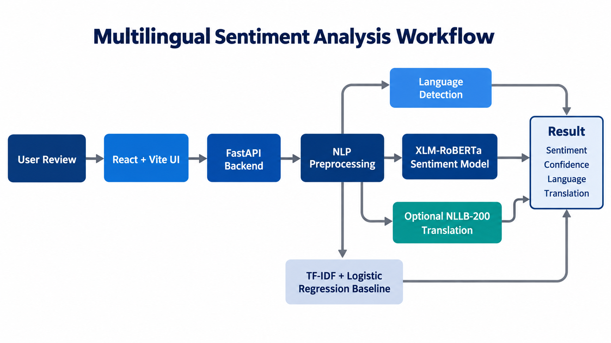

# SentimentScope - Multilingual Sentiment Analysis

SentimentScope is a full-stack Deep Learning and NLP project that classifies a review as **Positive**, **Negative**, or **Neutral**. A user pastes a review in English or a supported Indian language; the application detects its language, predicts sentiment, and can optionally translate it to another supported language.

The main model is a fine-tuned **XLM-RoBERTa** transformer. The project also includes a conventional **TF-IDF + Logistic Regression** baseline for comparison.

## Features

- React + Vite frontend and FastAPI backend
- Fine-tuned multilingual XLM-RoBERTa sentiment classifier
- Positive, Negative, and Neutral predictions with confidence
- Native-script language detection for supported Indian languages
- Optional NLLB-200 translation between supported languages
- TF-IDF + Logistic Regression baseline mode
- No login, database, review history, or stored user reviews

## Architecture

```text
React + Vite UI
      |
      v
FastAPI API
      |
      +--> NLP preprocessing: text cleaning and language detection
      +--> XLM-RoBERTa: sentiment prediction and confidence
      +--> TF-IDF + Logistic Regression: optional baseline mode
      +--> NLLB-200: optional translation
```



## Project Structure

```text
backend/main.py                 FastAPI routes, model loading, translation orchestration
src/preprocess.py               Text cleaning and language detection
src/baseline.py                 TF-IDF + Logistic Regression baseline
src/train_transformer.py        XLM-RoBERTa fine-tuning script
src/prepare_indic_dataset.py    Dataset preparation script
frontend/                       React + Vite user interface
data/indic_sentiment_large.csv  Training dataset
models/xlm-roberta-sentiment/   Fine-tuned model, stored with Git LFS
```

## Run Locally

### 1. Clone the project and download the model

Git LFS is required because the fine-tuned model is large.

```powershell
git clone https://github.com/Soham-Jathar/Multilingual-Sentiment-Analysis.git
cd Multilingual-Sentiment-Analysis
git lfs install
git lfs pull
```

If `git lfs` is not available, install Git LFS first and then reopen the terminal.

### 2. Start the backend

Open a PowerShell terminal in the project folder:

```powershell
py -m venv .venv
.\.venv\Scripts\python.exe -m pip install -r backend\requirements.txt
.\.venv\Scripts\python.exe -m uvicorn backend.main:app --reload --port 8001
```

The backend runs at `http://127.0.0.1:8001`.

### 3. Start the frontend

Open a second PowerShell terminal:

```powershell
cd frontend
npm.cmd install
npm.cmd run dev
```

Open the Vite address shown in the terminal, normally `http://localhost:5173`.

## Analysis Modes and Toggles

| XLM-RoBERTa | Translation | Result |
|---|---|---|
| On | Off | Recommended: the fine-tuned XLM-RoBERTa model predicts sentiment. |
| On | On | NLLB translates the review; XLM-RoBERTa predicts sentiment from the original review. |
| Off | Off | The TF-IDF + Logistic Regression baseline predicts sentiment. |
| Off | On | NLLB translates the review; the baseline predicts sentiment from the original review. |

## Confidence Calculation

For XLM-RoBERTa, the final classification layer produces one unnormalised score, called a **logit**, for each class: Negative, Neutral, and Positive. Softmax converts these scores into probabilities:

```text
p(class i) = exp(logit i) / sum(exp(all class logits))
```

The three probabilities add up to 1. The class with the largest probability is the sentiment prediction, and that same probability is shown as confidence. For example, probabilities of Negative `0.10`, Neutral `0.15`, and Positive `0.75` produce **Positive sentiment with 75% confidence**. The API receives this value as the transformer pipeline's `score`.

When baseline mode is selected, Logistic Regression uses `predict_proba()` to produce the three class probabilities; the highest value is again shown as confidence. Confidence is a model certainty estimate, not a guarantee that the prediction is correct. Validation accuracy and F1-score measure overall model performance across many labelled examples and are different from confidence for one review.

For the narrow English factual-question rule, the application intentionally returns Neutral with 100% confidence because the result is rule based, not a transformer probability.

## Translation

Translation is optional. The model is `facebook/nllb-200-distilled-600M`, where NLLB means **No Language Left Behind**. The first translation is slower because the translation model downloads and loads into memory. Later translations are faster while the backend remains running.

Supported native-script languages are English, Assamese, Bengali, Gujarati, Hindi, Kannada, Malayalam, Marathi, Odia, Punjabi, Tamil, and Telugu. Translation can use any supported source and target language pair.

## Dataset and Training

The included training file, `data/indic_sentiment_large.csv`, contains **12,500 labelled reviews**:

- 11 Indian languages from AI4Bharat IndicSentiment: 500 Positive and 500 Negative examples per language
- English Amazon reviews: 500 each for Positive, Negative, and Neutral
- Total: 6,000 Positive, 6,000 Negative, and 500 Neutral examples

To recreate the dataset:

```powershell
.\.venv\Scripts\python.exe -m src.prepare_indic_dataset --include-english --languages as bn gu hi kn ml mr or pa ta te --per-label 500
```

To fine-tune the model:

```powershell
.\.venv\Scripts\python.exe -m src.train_transformer --data data\indic_sentiment_large.csv --epochs 3 --batch-size 8
```

Three epochs are sufficient for this mini project because XLM-RoBERTa is already pretrained on multilingual text. The training script evaluates every epoch and retains the checkpoint with the best validation F1-score.

## API Routes

| Method | Route | Purpose |
|---|---|---|
| `GET` | `/api/health` | Confirms that the backend is running. |
| `POST` | `/api/analyze` | Accepts review text and analysis options, then returns sentiment, confidence, language, and optional translation. |

## Limitations

- Native scripts are supported; Romanized or transliterated text such as `khup changla aahe` is not a project target.
- **Neutral-data limitation:** Neutral examples are primarily English, so Neutral predictions for some Indian languages may be less reliable.
- The first translation request requires the NLLB model to download, so internet access is needed once for that model.

## Privacy

The current application does not use a database, login system, or history feature. Reviews are processed only to produce the current result and are not stored.
